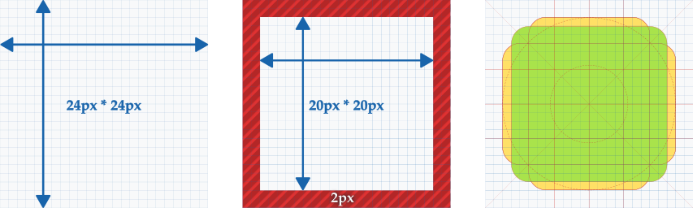
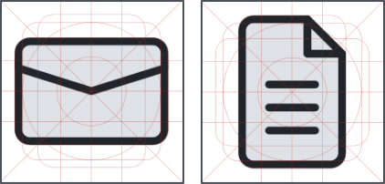
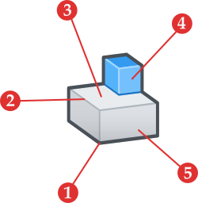
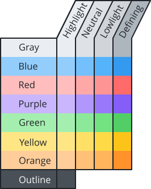

# Icon Guidelines

 ‎‎

## Introduction

If a picture is worth a thousand words, a well-designed icon is worth at least a hundred! These commonly used, often barely thought about, symbols are crucial in conveying a lot of information in a compact amount of space. The following documentation is meant to provide a framework for consistency, readability, and clarity of icons across the entirety of the FreeCAD ecosystem.

The following links describe the underlying theory behind these guidelines:

- [Aesthetic-Usability Effect](https://lawsofux.com/aesthetic-usability-effect) -- Icons should be visually appealing to improve usability.

- [Cognitive Load](https://lawsofux.com/cognitive-load/) -- Minimize complexity to reduce cognitive load.

- [Jakob’s Law](https://lawsofux.com/jakobs-law/) -- Follow existing conventions for familiar user experience.

- [Law of Prägnanz](https://lawsofux.com/law-of-pr%C3%A4gnanz/) -- Strive for simple and memorable forms.

- [Law of Uniform Connectedness](https://lawsofux.com/law-of-uniform-connectedness/) -- Group related elements visually.

- [Paradox of the Active User](https://lawsofux.com/paradox-of-the-active-user/) -- Balance simplicity with understandable forms.

- [Tesler’s Law](https://lawsofux.com/teslers-law/) -- Avoid offloading complexity onto the user wherever possible.  

 

### General rules for the design of FreeCAD icons:

- Deviations from these guidelines are only allowed when absolutely necessary to maintain visual consistency/compatibility with the rest of the application.

- Color use should be minimal and intentional. It must not be relied upon to convey function. A good icon should be understandable even when drawn in grayscale. 

- Color may be used to assist with logical grouping. Follow conventions found in existing icons.

- Icons must only use colors from the provided palette.

- Template and palette files for Inkscape are provided.

- Use of the FreeCAD logo within icons should be avoided.

- Gradients are only allowed as described below.

- Icons are simple communication tools; realism (skeuomorphism) is avoided.

 

## Icon Template and Zones

Icons are designed on a 24 pixel grid. Shown above are the general size and placement areas for use. These are used to help provide consistency in size, form and area across icons. Additionally, icons must respect a 2px blockout perimeter leaving a 20px functional area for designs. Violations of this protected area should be minimal, uncommon, and accepted into the project only under rare circumstances.

   ‎

Rectangular icons can fill either of the yellow zones shown above. Primary focus should be to utilize the green square. Here are some simple examples of potential orientations:

 

## Anatomy of a FreeCAD icon

 

1. **Outline** -- provides definition and contrast along the external perimeter of the icon and support visibility against different background colors.

2. **Defining Line** -- used to provide form and definition to an icon.

3. **Closed Shape** -- must use a solid fill color.

4. **Action Area** -- typically uses complementary shades of a primary palette color to accentuate the purpose/function represented.

5. **Gradient** -- provides subtle depth and visual connection between 2D and 3D icon symbols.

 

### Design rules for icon elements

#### Outline:

- Outline must be 1.0px in thickness, drawn using a path-based shape or stroke outline (path-based are preferred).

- Outline must fully cover the perimeter wherever the background meets edges of the icon.

#### Defining Lines:

- Defining lines add visual clarity and necessary detail for icons. For 3D icons defining lines of the 'contrast' shade of the respective color should be used and be drawn at 0.5px thickness. For 2D (i.e. flat) icons, defining lines should use the perimeter color and a 1.0px thickness is preferred.
- For line icons, use the 'neutral' gray with a 2.0px weight and modify the Outline rule to 1.0px.

#### Closed Shapes:

- Closed shapes will have a color fill. The palette includes 3 shades of each color to allow for a shading effect. Icons not representing 3D objects will use the 'neutral' shade of the respective color.

- Closed shapes should not use color gradients.

#### Action Area:

- This is a color splash used to accent, but not define the purpose of a function. Mixing multiple base colors (i.e. green and red tones together) in a single icon should be avoided wherever possible.

#### Gradient:

- The gradient must only be applied using an outline of the icon shape. This provides visual connectedness between 2D and 3D icon elements by adding subtle depth.

- The gradient will transition vertically from bottom to top using the outline color to the white tone(set to 0% transparency). The gradient white color must have a stop offset of 0.5 (or 50%).

 

### 3D Perspective Icons:

- 3D perspectives should only be used for functions not easily indicated by a simple 2D shape.

- 3D icons will be drawn using an axonometric grid. This grid is present, but disabled through the document properties in Inkscape. Axonometric grid parameters are as follows: Spacing Y = 1.0; Angle X = 33.0; Angle Z = 6.5.

- Lighting/Shading must assume a light position of above-right in relation to the icon object.

 

### 2D Perspective Icons:

* 2D icons must have no perceived shading outside of the prescribed gradient above.

* 2D icons must only use the 'primary' shade of any color from the palette.

* 2D icons should use only one or two colors following the same approach of a gray color with the addition of a single action color as needed.

 

### 2D Line Art Icons:

* Line Art icons are an exception, they represent functions that only work on lines or curves. They are not easily represented with a standard closed shape or 
* Outline requirements convey to such icons to ensure portability across different colored backgrounds.

 

#### Color Palette

**Gray** -- must be the primary color found in icons. For monochromatic icons, gray neutral should be the only fill color used.

**Blue** -- must be the color used for actions that add or subtract from 3D shapes.
